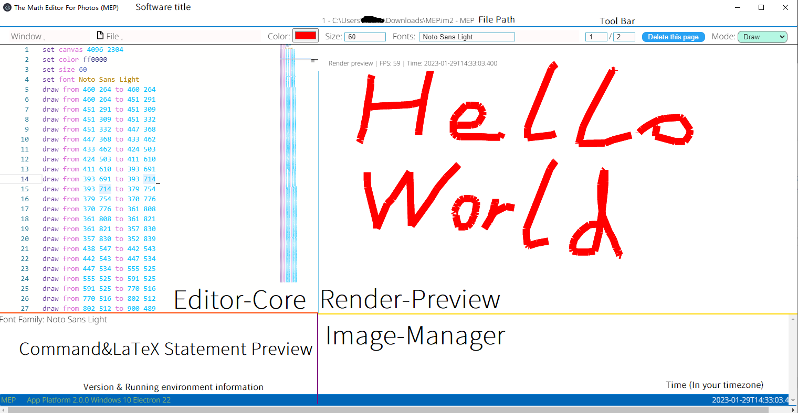
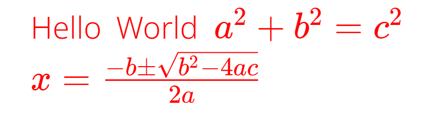

# the Math Editor for Photos (MEP) 2.1.1 Documentation

- - -
Visit counts: 
- - -
### Basic information
The official website of MEP@2 is <https://mep2.lihugang.top>. Source code address is <https://github.com/lihugang/mep2>. As an open source software, we also welcome you to modify and improve this software. However, it should be noted that this software is based on **GPL3**, and you need to abide by this open source license <https://www.gnu.org/licenses/gpl-3.0.en.html>
- - -
### How to download
Use your browser to visit <https://mep2.lihugang.top/download> or <https://github.com/lihugang/mep2/releases> and download the version which you wants to use. Generally, we offered 64-bit executable files for Windows. If you want to use it in other platforms, please send an issue at <https://github.com/lihugang/mep2/issues> or build it on your own.
- - -
### How to build
1. Clone repository from GitHub `git clone https://github.com/lihugang/mep2.git --depth=1`
2. Change directory to cloned repository `cd mep2`
3. Install dependicies `pnpm install`
4. Build frontend programs `pnpm run build` (You must install **node** and **pnpm** first)
- - -
1. For web platform, make a new directory to store service `mkdir ~/mep@2-web/`
2. Copy server source code to a new directory `cp -r ./backend/web/ ~/mep@2-web/`
3. Create a directory to store client resources `mkdir ~/mep@2-web/resources/`
4. Copy client builds `cp -r ./dist/ ~/mep@2-web/resources/`
5. Change directory to service path `cd ~/mep@2-web/`
6. Install dependicies `pnpm install`
7. Transpile `ts` code to `js` `pnpm run build`
8. Start service `node .`
- - -
1. For app platform, make a new directory to store source code `mkdir ~/mep@2-app/`
2. Copy app backend source codes `cp -r ./backend/app/ ~/mep@2-app/`
3. Make a directory to store client resources `mkdir ~/mep@2-app/resources/`
4. Copy client builds `cp -r ./dist/ ~/mep@2-app/resources/`
5. Change directory to service path `cd ~/mep@2-app/`
6. Install dependicies `pnpm install`
7. Build `pnpm run build`
- - -
### What are the differencies between the web platform and the app platform
1. Because of browser limits, some functions may be forbiddened or not work well.
2. In order to ensure you're using app, the software in the web platform cannot export single page as .pdf or export all pages as .png
3. The exports in the web platform must be added a watermark, but in the app, you can disable adding watermarks.
- - -
### How to use editor

#### Editor Commands
`set canvas $width $height` set the canvas size  
- width: a positive integer  
- height: a positive integer  

`set color $color` set text and painting brush color  
- color: a string with six characters in hexadecimal  

`set size $size` set text size and painting brush weight
- size: a positive integer between 1 and 300

`set font $font` set text font family
- font: string

`draw from $sx $sy to $dx $dy` draw line from $sx $sy to $dx $dy
- sx: start position(x), a positive integer between 0 and $canvas-width
- sy: start position(y), a positive integer between 0 and $canvas-height
- dx: destination position(x), a positive integer between 0 and $canvas-width
- dy: destination position(y), a positive integer between 0 and $canvas-height
- Notice: The coordinate system is rotated 90°clockwise from the plane Cartesian coordinate system along the origin, taking the first quadrant  
- Notice: You can switch mode to `Draw` and use your mouse paint in the render preview region, `draw` statements will be generated automatically  

`image $locate_method $sha256 at $x $y resize $resize_method $width $height` put image in the canvas  
- locate_method: `abs` or `rwd`   
- x: if $locate_method is `abs`, x is a positive integer between 0 and $canvas-width, otherwise, x is a real between 0 and 1  
- y: if $locate_method is `abs`, y is a positive integer between 0 and $canvas-height, otherwise, y is a real between 0 and 1  
- abs: absolute locating, element is always in this position whatever the size of canvas is.  
- rwd: responsive layout, given the position ratio of the element in the canvas, its position is automatically calculated and changed with the size of the canvas
- resize_method: `abs` or `rwd`  
- width: image width, the same with `x`  
- height: image height, the same with `y`  

`text $locate_method $x $y $text` put text in the canvas
- locate_method/x/y: the same with the `image` locate statements
- text: the text content, if you want to type some math formulas, please put them beside `$` and `$`, use `\\` to change into the next line  
  For example, `text rwd 0.5 0.5 Hello World $a^2+b^2=c^2 \\ x=\frac{-b\pm\sqrt{b^2-4ac}}{2a}$`     
- Now, we support multi-line text macro such as this 
  ```
  text rwd 0.5 0.5 `
  Hello World
  $x=\frac{-b \pm \sqrt{b^2-4ac} }{2a}$
  `
  ```
  . It will be converted into `text rwd 0.5 0.5 Hello World $\\$ $x=\frac{-b \pm \sqrt{b^2-4ac} }{2a}$` after preprocessing.
  For further details, please see [issue/6](https://github.com/lihugang/mep2/issues/6) (**2.1.2** or later version supports this function)

`macro $key $value` define a LaTeX macro (If you feel typing LaTeX commands is too long, you can define a macro. However, we recommend that you add `snippets` to the configuration to quickly complete code snippets through Monaco-editor's smart prompts.)
- key: a string, the new macro name
- value: a string, the new macro value

- - -
### LaTeX Symbol Table
#### Some usual symbols
  
Reference: <https://www.overleaf.com/latex/templates/symbol-table/fhqmttqvrnhk.pdf>  
#### Full
Please see `/docs/latex-symbols.pdf`  
Reference: <https://www.cmor-faculty.rice.edu/~heinken/latex/symbols.pdf>  
- - -
### How to change language
1. Open your app or web page and wait for loading
2. Click `Settings` button
3. Find `Languages` and select your preferred language, for example, `en-US`(English, USA) or `zh-CN`(simplified Chinese, Chinese Mainland)
4. **Scroll to the bottom, and click `Save` button**
- - -
### How to disable updating automatically
If you are using app:
- 1. Open your app and wait for loading
- 2. Click `Setting` button
- 3. Find `Automatically update` and click the `Enabled` button in the right, now you disable it
- 4. **Scroll to the bottom, and click `Save` button**

If you are using web platform through our demo <https://demo.mep2.lihugang.top>:
**Sorry, the website will be updated when our publish a new release.**

If you are using other web platforms which you or others built:
Congratulations! In web platform, software will not be updated automatically. If you want to update them, please rebuild.